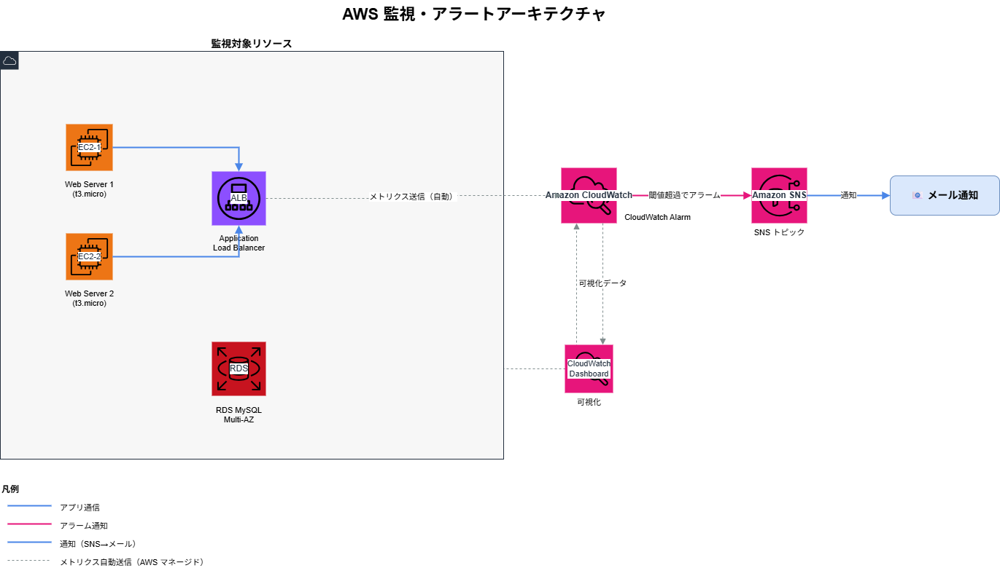

# terraform-aws-operations

AWS インフラの監視・アラート設定と障害対応 Runbook を Terraform でコード化した運用自動化 PoC。
CloudWatch + SNS による異常検知から、障害一次対応手順書（Runbook）まで、副業での AWS 運用補助業務を想定した実践的な構成です。

---

## アーキテクチャ



| コンポーネント | 内容 |
|---|---|
| **Amazon CloudWatch** | EC2 / ALB / RDS の監視アラーム + ダッシュボード |
| **Amazon SNS** | アラーム検知時のメール通知（Confirm subscription 方式） |
| **IAM Role** | CloudWatch → SNS への最小権限ポリシー |
| **Runbook** | EC2 / ALB / RDS の障害一次対応手順書（Markdown） |

---

## 監視項目

| リソース | 監視内容 | デフォルト閾値 | 変数名 |
|---------|---------|--------------|-------|
| EC2 | CPU 使用率 | 80%（5分間） | `ec2_cpu_threshold` |
| EC2 | ステータスチェック失敗 | 1回以上 | — |
| ALB | 5xx エラー数 | 10件/分 | `alb_5xx_threshold` |
| RDS | CPU 使用率 | 80%（5分間） | `rds_cpu_threshold` |
| RDS | 空きストレージ | 5GB 以下 | `rds_storage_threshold_gb` |

閾値はすべて `terraform.tfvars` で上書き可能です。

---

## デモ（Runbook）

| ファイル | 対象障害 |
|---------|--------|
| [01_ec2_troubleshooting.md](docs/runbook/01_ec2_troubleshooting.md) | EC2 接続不可・CPU 高負荷・ステータスチェック失敗 |
| [02_alb_rds_troubleshooting.md](docs/runbook/02_alb_rds_troubleshooting.md) | ALB 502/504・RDS 接続エラー・ストレージ逼迫 |

---

## 技術スタック

| カテゴリ | 技術・サービス |
|---------|--------------|
| IaC | Terraform（モジュール構成） |
| 監視 | Amazon CloudWatch（アラーム・ダッシュボード） |
| 通知 | Amazon SNS（メール通知） |
| 対象 | EC2 / ALB / RDS |
| 権限管理 | IAM Role（最小権限） |

---

## ディレクトリ構成

```
terraform-aws-operations/
├── terraform/
│   ├── main.tf              # モジュール統合・SNS トピック定義
│   ├── variables.tf         # 監視対象・閾値の変数定義
│   ├── outputs.tf           # SNS ARN・ダッシュボード URL 出力
│   ├── provider.tf
│   ├── terraform.tfvars.example
│   └── modules/
│       ├── monitoring/      # CloudWatch アラーム・ダッシュボード
│       └── iam/             # CloudWatch → SNS 権限ロール
└── docs/
    ├── architecture.drawio
    ├── architecture.drawio.png
    └── runbook/
        ├── 01_ec2_troubleshooting.md
        └── 02_alb_rds_troubleshooting.md
```

---

## デプロイ手順

### 前提条件

- AWS CLI 設定済み（`ap-northeast-1`）
- Terraform >= 1.5
- 監視対象の EC2 / ALB / RDS が存在すること

### 1. 変数ファイルを作成

```bash
cd terraform
cp terraform.tfvars.example terraform.tfvars
```

`terraform.tfvars` を編集して以下を設定：

```hcl
alert_email             = "your@email.com"
ec2_instance_ids        = ["i-xxxxxxxxxxxxxxxxx"]
alb_arn_suffix          = "app/my-alb/xxxxxxxxxxxxxxxx"
rds_instance_identifier = "my-rds-instance"
```

### 2. Terraform apply

```bash
terraform init
terraform plan
terraform apply
```

### 3. SNS サブスクリプション確認

apply 後、指定メールに確認メールが届きます。**必ず「Confirm subscription」をクリック**してください。クリック前はアラームが届きません。

### 4. ダッシュボード確認

```bash
terraform output dashboard_url
# 出力 URL をブラウザで開く
```

### 5. リソース削除

```bash
terraform destroy
```

---

## IAM 設計（最小権限）

| ロール | 権限 | 理由 |
|---|---|---|
| CloudWatch Alarm Role | `sns:Publish`（対象 SNS トピックのみ） | アラーム → SNS 通知に必要な最小権限 |

---

## 技術的なポイント・工夫

- **変数化による再利用性**: 監視対象の EC2 ID・ALB ARN・RDS 識別子・閾値をすべて変数化。`terraform.tfvars` を書き換えるだけで任意の環境に適用できる
- **モジュール構成**: `monitoring/`（アラーム・ダッシュボード）と `iam/`（権限）を分離し、独立して再利用可能
- **for_each による複数 EC2 対応**: EC2 アラームは `for_each` で複数インスタンスを一括管理
- **Runbook のコード管理**: 障害対応手順書を Markdown で Git 管理し、インフラコードと一体で運用できる設計
- **SNS Confirm subscription**: apply 直後のメール確認忘れを防ぐため、README と outputs に明記

---

## コスト目安

| リソース | 概算 |
|---------|------|
| CloudWatch アラーム | $0.10 / アラーム / 月（10個で約 $1/月） |
| SNS メール通知 | 100,000件まで無料 |
| CloudWatch ダッシュボード | $3 / ダッシュボード / 月 |

> 検証後は `terraform destroy` でリソース削除を推奨。

---

## 副業・面談でのアピールポイント

- **「監視設定も IaC で管理できる」**: CloudWatch アラームを手動でポチポチではなく Terraform でコード化。環境の再現性・変更履歴の担保を説明できる
- **「Runbook まで一体管理」**: アラームが鳴った後の対応手順書も Git で管理。インフラ担当が "作るだけ" でなく "運用まで考える" 姿勢を示せる
- **「モジュール化で横展開できる」**: 別プロジェクト（terraform-3tier-webapp 等）の監視設定に同モジュールをそのまま適用可能

---

## 関連リポジトリ

- [terraform-3tier-webapp](https://github.com/satoshif1977/terraform-3tier-webapp) - この monitoring モジュールの監視対象となる 3 層 Web アーキテクチャ
- [aws-ecs-bedrock-chat](https://github.com/satoshif1977/aws-ecs-bedrock-chat) - ECS Fargate + Bedrock チャットアプリ（CloudWatch Logs 連携）
