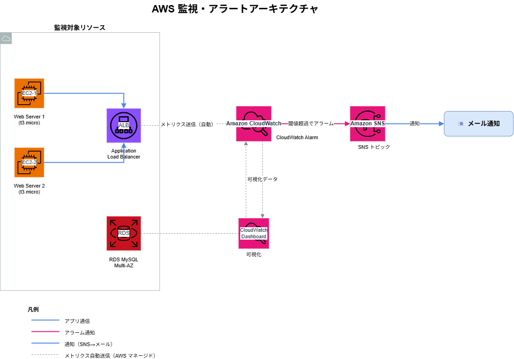
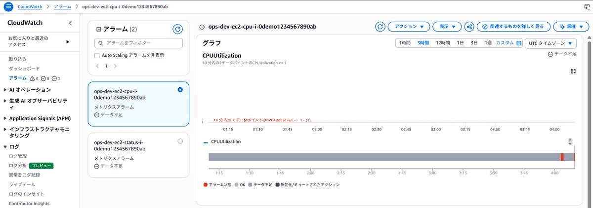

# terraform-aws-operations


[](https://github.com/satoshif1977/terraform-aws-operations/actions/workflows/ts-test.yml)


AWS インフラの**監視・セキュリティ監視・障害対応 Runbook** を Terraform でコード化した運用自動化 PoC。
CloudWatch + SNS による異常検知、GuardDuty / Security Hub / AWS Config によるセキュリティ3本柱、障害一次対応手順書（Runbook）まで、AWS 運用補助業務を想定した実践的な構成です。

---

## アーキテクチャ



| コンポーネント | 内容 |
|---|---|
| **Amazon CloudWatch** | EC2 / ALB / RDS / Lambda の監視アラーム + ダッシュボード |
| **Amazon SNS** | アラーム検知・GuardDuty Finding のメール通知 |
| **Amazon GuardDuty** | 脅威検知（S3 アクセス異常 / EBS マルウェアスキャン） |
| **AWS Security Hub** | CIS Benchmark v1.4.0 + AWS FSBP によるコンプライアンス評価 |
| **AWS Config** | 全リソース設定記録 + コンプライアンスルール 4件 |
| **EventBridge** | GuardDuty Finding（severity ≥ 4.0）を Lambda へ転送 |
| **AWS Lambda (Python)** | GuardDuty Finding を日本語整形して SNS 通知 |
| **IAM Role** | 各サービスへの最小権限ポリシー |
| **Runbook** | EC2 / ALB / RDS の障害一次対応手順書（Markdown） |

---

## 監視項目

| リソース | 監視内容 | デフォルト閾値 | 変数名 |
|---------|---------|--------------|-------|
| EC2 | CPU 使用率 | 80%（5分間） | `ec2_cpu_threshold` |
| EC2 | ステータスチェック失敗 | 1回以上 | — |
| ALB | 5xx エラー数 | 10件/分 | `alb_5xx_threshold` |
| RDS | CPU 使用率 | 80%（5分間） | `rds_cpu_threshold` |
| RDS | 空きストレージ | 5GB 以下 | `rds_storage_threshold_gb` |
| **Lambda** | **エラー数** | **1件以上/5分** | `lambda_error_threshold` |
| **Lambda** | **実行時間** | **10秒以上** | `lambda_duration_threshold_ms` |
| **Lambda** | **スロットリング** | **1件以上/5分** | `lambda_throttle_threshold` |

閾値はすべて `terraform.tfvars` で上書き可能です。

---

## デモ



CloudWatch アラームが ALARM 状態に発火し、SNS 通知が送信される様子。ダッシュボードで監視状況を一元確認できます。

---

## デモ（Runbook）

| ファイル | 対象障害 |
|---------|--------|
| [01_ec2_troubleshooting.md](docs/runbook/01_ec2_troubleshooting.md) | EC2 接続不可・CPU 高負荷・ステータスチェック失敗 |
| [02_alb_rds_troubleshooting.md](docs/runbook/02_alb_rds_troubleshooting.md) | ALB 502/504・RDS 接続エラー・ストレージ逼迫 |

### Runbook の更新方法

新しいアラームや監視対象を追加した際は、対応する Runbook も同時に更新します。

```bash
# 1. 既存 Runbook を参考に新ファイルを作成
cp docs/runbook/01_ec2_troubleshooting.md docs/runbook/03_new_service_troubleshooting.md

# 2. 必要なセクションを編集（症状・原因・確認コマンド・対処手順）
# 3. README のデモ表に追記してコミット
git add docs/runbook/03_new_service_troubleshooting.md README.md
git commit -m "docs: add runbook for <service name>"
```

Runbook のフォーマット（推奨）:

```markdown
## 症状
- 何が起きているか

## 考えられる原因
1. 原因 A
2. 原因 B

## 確認コマンド
\`\`\`bash
aws cloudwatch describe-alarms --alarm-names "alarm-name"
\`\`\`

## 対処手順
1. ステップ 1
2. ステップ 2
```

---

## 技術スタック

| カテゴリ | 技術・サービス |
|---------|--------------|
| IaC | Terraform（メイン） / CloudFormation（比較実装） |
| 言語 | HCL（Terraform） / Python 3.13（Lambda）/ **Go 1.21（Lambda 並置実装）** |
| 監視 | Amazon CloudWatch（アラーム・ダッシュボード） |
| セキュリティ | Amazon GuardDuty / AWS Security Hub / AWS Config |
| イベント連携 | Amazon EventBridge（GuardDuty Finding ルーティング） |
| 通知 | Amazon SNS（CloudWatch アラーム + GuardDuty Finding） |
| 対象リソース | EC2 / ALB / RDS / Lambda |
| 権限管理 | IAM Role（各サービス最小権限） |

---

## Go 版 Lambda 並置実装

`lambda_go/guardduty-notifier/` に、Python 版（`lambda/guardduty-notifier/index.py`）と同じロジックを **Go で実装した並置実装**を追加しています。

```
lambda/guardduty-notifier/index.py        # Python 3.13 実装
lambda_go/guardduty-notifier/main.go      # Go 1.21 実装（同ロジック）
lambda_go/guardduty-notifier/main_test.go # Go テスト（10件）
```

### Python vs Go 比較

| 観点 | Python | Go |
|---|---|---|
| コールドスタート | ~300ms | **~100ms**（約3倍速） |
| メモリ使用量 | ~60MB | **~30MB**（約半分） |
| デプロイ成果物 | ランタイム + コード | **単一バイナリ**（bootstrap） |
| 型安全性 | 実行時エラー | **コンパイル時エラー** |

> GuardDuty 通知は低頻度なので Python で十分ですが、Go 版は「高頻度イベント対応時の移行候補」として維持しています。

### Go 版ビルド手順

```bash
cd lambda_go
go mod tidy

# Lambda 向けバイナリビルド（Linux/amd64）
GOOS=linux GOARCH=amd64 go build -o guardduty-notifier/bootstrap ./guardduty-notifier/
zip -j guardduty-notifier.zip guardduty-notifier/bootstrap

# テスト実行
go test ./guardduty-notifier/... -v
```

---

## CloudFormation 版について

`cloudformation/template.yaml` に、Terraform 版と同等の監視構成を CloudFormation で実装しています。
IaC ツール間の設計思想の違いを比較学習することを目的とした参考実装です。

| 機能 | Terraform | CloudFormation |
|-----|-----------|---------------|
| 複数リソースのループ | `for_each = toset(var.list)` | 個別パラメータ + `Conditions` で代替 |
| 条件付きリソース | `count = var.xxx != "" ? 1 : 0` | `Conditions` + `Condition:` キー |
| 数値演算 | `var.gb * 1024 * 1024 * 1024` | 演算非対応 → バイト値を直接指定 |
| 状態管理 | S3 + DynamoDB（tfstate） | CloudFormation が内部管理（マネージド） |

詳細は [`cloudformation/README.md`](cloudformation/README.md) を参照。

---

## ディレクトリ構成

```
terraform-aws-operations/
├── terraform/               # Terraform 版（メイン）
│   ├── main.tf              # SNS トピック・CloudWatch アラーム定義
│   ├── security.tf          # GuardDuty / Security Hub / AWS Config 定義
│   ├── variables.tf         # 監視対象・閾値・セキュリティ ON/OFF 変数
│   ├── outputs.tf           # SNS ARN・ダッシュボード URL・GuardDuty ID 出力
│   ├── provider.tf          # AWS / archive プロバイダー設定
│   ├── terraform.tfvars.example
│   └── tests/               # terraform test（17 テスト・mock_provider 使用）
│       ├── defaults.tftest.hcl
│       ├── conditional_resources.tftest.hcl
│       └── naming.tftest.hcl
├── lambda/
│   └── guardduty-notifier/
│       └── index.py         # GuardDuty Finding → SNS 通知 Lambda（Python）
├── cloudformation/          # CloudFormation 版（Terraform との比較用）
│   ├── template.yaml        # 同等監視構成の CFn テンプレート
│   └── README.md            # デプロイ手順・Terraform との差異比較
└── docs/
    ├── architecture.drawio
    ├── architecture.drawio.png
    └── runbook/
        ├── 01_ec2_troubleshooting.md
        └── 02_alb_rds_troubleshooting.md
```

---

## デプロイ手順

### 前提条件

- AWS CLI 設定済み（`ap-northeast-1`）
- Terraform >= 1.5
- 監視対象の EC2 / ALB / RDS が存在すること

### 1. 変数ファイルを作成

```bash
cd terraform
cp terraform.tfvars.example terraform.tfvars
```

`terraform.tfvars` を編集して以下を設定：

```hcl
alert_email             = "your@email.com"
ec2_instance_ids        = ["i-xxxxxxxxxxxxxxxxx"]
alb_arn_suffix          = "app/my-alb/xxxxxxxxxxxxxxxx"
rds_instance_identifier = "my-rds-instance"
```

### 2. Terraform apply

```bash
terraform init
terraform plan
terraform apply
```

### 3. SNS サブスクリプション確認

apply 後、指定メールに確認メールが届きます。**必ず「Confirm subscription」をクリック**してください。クリック前はアラームが届きません。

### 4. ダッシュボード確認

```bash
terraform output dashboard_url
# 出力 URL をブラウザで開く
```

### 5. リソース削除

```bash
terraform destroy
```

---

## IAM 設計（最小権限）

| ロール | 権限 | 理由 |
|---|---|---|
| CloudWatch Alarm Role | `sns:Publish`（対象 SNS トピックのみ） | アラーム → SNS 通知に必要な最小権限 |
| guardduty-notifier-role | `sns:Publish`（対象 SNS トピックのみ）+ `AWSLambdaBasicExecutionRole` | GuardDuty Finding を SNS に転送する最小権限 |
| config-role | `AWS_ConfigRole`（マネージドポリシー） | AWS Config がリソースを記録・S3 に配信するために必要な権限 |

---

## 技術的なポイント・工夫

- **変数化による再利用性**: 監視対象の EC2 ID・ALB ARN・RDS 識別子・閾値をすべて変数化。`terraform.tfvars` を書き換えるだけで任意の環境に適用できる
- **セキュリティ ON/OFF フラグ**: `guardduty_enabled` / `securityhub_enabled` / `config_enabled` で dev 環境のコスト節約が可能
- **GuardDuty severity フィルタ**: EventBridge で severity ≥ 4.0（MEDIUM以上）のみ Lambda へ転送することでノイズを削減
- **Python Lambda で構造化通知**: GuardDuty Finding を日本語整形し、重大度・タイプ・コンソール URL を含む可読性の高いメール通知を実現
- **IaC セキュア・バイ・デフォルト**: Config ログ用 S3 はバージョニング・SSE-AES256・パブリックアクセスブロック・バケットポリシーを最初から組み込み
- **for_each による複数 EC2 対応**: EC2 アラームは `for_each` で複数インスタンスを一括管理
- **Runbook のコード管理**: 障害対応手順書を Markdown で Git 管理し、インフラコードと一体で運用できる設計

---

## コスト目安

| リソース | 概算 |
|---------|------|
| CloudWatch アラーム | $0.10 / アラーム / 月（10個で約 $1/月） |
| SNS メール通知 | 100,000件まで無料 |
| CloudWatch ダッシュボード | $3 / ダッシュボード / 月 |
| GuardDuty | 最初の 30日間無料 / 以降は処理データ量に応じた従量課金 |
| Security Hub | 最初の 30日間無料 / 以降 $0.0010 / チェック / 月 |
| AWS Config | $0.003 / 設定アイテム記録 / リージョン |
| Lambda（notifier） | 月 100万リクエスト / 400,000 GB-秒まで無料 |

> GuardDuty / Security Hub / Config は無料トライアル終了後に課金が発生します。検証後は `terraform destroy` またはフラグで無効化（`guardduty_enabled = false` 等）を推奨。

---

## 技術的な見どころ

- **「監視設定も IaC で管理できる」**: CloudWatch アラームを手動でポチポチではなく Terraform でコード化。環境の再現性・変更履歴の担保を説明できる
- **「セキュリティ3本柱を一括管理」**: GuardDuty（検知）+ Security Hub（ダッシュボード）+ Config（コンプライアンス）を Terraform で一体管理。企業ガバナンス要件への対応を示せる
- **「Python × Terraform の組み合わせ」**: HCL だけでなく Python Lambda を組み合わせることで多言語スタックの実例として訴求できる
- **「Runbook まで一体管理」**: アラームが鳴った後の対応手順書も Git で管理。インフラ担当が "作るだけ" でなく "運用まで考える" 姿勢を示せる
- **「モジュール化で横展開できる」**: 別プロジェクト（terraform-3tier-webapp 等）の監視設定に同モジュールをそのまま適用可能

---

## 学習で気づいたこと・躓いたポイント

### CloudWatch アラーム設計

- **SNS Confirm subscription の忘れ**: `terraform apply` 後にメールが届いても「Confirm subscription」をクリックしないとアラームが届かない。自動化できない手動ステップのため、README への明記と apply 後の確認手順化が必須。
- **`for_each` で複数 EC2 アラームを一括管理**: EC2 インスタンス ID のリストを変数化し `for_each` で回すと、インスタンス追加時に `variables.tf` の変更だけで対応できる。個別にリソースを書くより拡張性が高い。
- **CloudWatch ダッシュボードの JSON 定義**: `dashboard_body` に JSON を直接書くと可読性が下がる。`jsonencode()` を使うと Terraform 変数を埋め込みつつ、構造を人間が読みやすい形で記述できる。

### Terraform モジュール設計

- **`monitoring/` と `iam/` の分割**: アラームモジュールに IAM を混在させると再利用しにくくなる。IAM ロールを独立したモジュールに切り出し、ARN を outputs で渡す設計にするとモジュールの独立性が高まる。
- **`terraform.tfvars` の変数が多くなる**: 監視対象が増えると変数が増える。環境ごとに `terraform.tfvars` を分け、`environments/dev` / `environments/prod` 構成にすることでスケールしやすくなる。

---

## トラブルシューティング

| 症状 | 原因 | 対処法 |
|---|---|---|
| アラームが届かない | SNS サブスクリプション未確認 | apply 後に届いたメールの「Confirm subscription」をクリック |
| アラームが `INSUFFICIENT_DATA` のまま | 監視対象リソースが存在しない | `ec2_instance_ids` / `alb_arn_suffix` / `rds_instance_identifier` が正しいか確認 |
| `terraform apply` で `AlreadyExistsException` | SNS トピック名が競合 | `terraform.tfvars` の `project_name` を変更して再 apply |
| ダッシュボードの URL が開かない | outputs 未確認 | `terraform output dashboard_url` で URL を取得してブラウザで開く |

---

## ローカル開発・テスト方法

### Python ユニットテスト（AWS 接続不要）

Lambda 関数のロジックを boto3 モックで検証します。AWS 接続は不要です。

```bash
pip install pytest boto3 botocore
pytest lambda/ -v
```

| テストファイル | テスト数 | 主な検証内容 |
|---|---|---|
| `lambda/guardduty-notifier/test_index.py` | 24 件 | Finding 整形・重大度判定・SNS 送信・エラーハンドリング |
| `lambda/streams-alert/test_index.py` | 11 件 | DynamoDB Streams イベント処理・SNS 送信・エラーハンドリング |
| **合計** | **35 件** | |

---

### Terraform の静的チェック（AWS 接続不要）

```bash
cd terraform
terraform fmt -check
terraform validate
```

### Checkov ローカルスキャン

```bash
pip install checkov
checkov -d terraform/ --soft-fail
```

### アラームの手動テスト（apply 後）

```bash
# EC2 CPU アラームを手動で ALARM 状態にして SNS 通知が届くか確認
aws-vault exec personal-dev-source -- aws cloudwatch set-alarm-state \
  --alarm-name "<アラーム名>" \
  --state-value ALARM \
  --state-reason "手動テスト"
```

---

## AI 活用について

本プロジェクトは以下の Anthropic ツールを活用して開発しています。

| ツール | 用途 |
|---|---|
| **Claude Code** | インフラ設計・コード生成・デバッグ・コードレビュー。コミットまで一貫してサポート |
| **Claude Cowork** | 技術調査・設計相談・ドキュメント作成を日常的に活用。AI との協働を業務フローに組み込んでいる |
| **カスタム Skills** | Terraform / Python / AWS に特化した Skills を設定・継続的に更新。自分の技術スタックに最適化したワークフローを構築 |

> AI を「使う」だけでなく、自分の業務・技術スタックに合わせて**設定・運用・改善し続ける**ことを意識しています。

---

## 関連リポジトリ

- [terraform-3tier-webapp](https://github.com/satoshif1977/terraform-3tier-webapp) - この monitoring モジュールの監視対象となる 3 層 Web アーキテクチャ（Terraform 版）
- [aws-cdk-3tier-app](https://github.com/satoshif1977/aws-cdk-3tier-app) - 同構成の CDK 版。`monitoring-construct.ts` で同等の CloudWatch アラームを実装
- [aws-ecs-bedrock-chat](https://github.com/satoshif1977/aws-ecs-bedrock-chat) - ECS Fargate + Bedrock チャットアプリ（CloudWatch Logs 連携）

## Security

See [SECURITY.md](SECURITY.md) for vulnerability reporting and security policies.
